# H1 Report

* Name: 黃建凱
* ID:D1285092

---

## 題目：象棋翻棋遊戲
考慮一個象棋翻棋遊戲，32 個棋子會隨機的落在 4*8的棋盤上。透過 Chess 的建構子產生這些棋子並隨機編排位置，再印出這些棋子的名字、位置
ChessGame
void showAllChess();
void generateChess();
Chess:
Chess(name, weight, side, loc);
String toString();
同上，
ChessGame 繼承一個抽象的 AbstractGame; AbstractGame 宣告若干抽象的方法：
setPlayers(Player, Player)
boolean gameOver()
boolean move(int location)
撰寫一個簡單版、非 GUI 介面的 Chess 系統。使用者可以在 console 介面輸入所要選擇的棋子的位置 (例如 A2, B3)，若該位置的棋子未翻開則翻開，若以翻開則系統要求輸入目的的位置進行移動或吃子，如果不成功則系統提示錯誤回到原來狀態。每個動作都會重新顯示棋盤狀態。

## 設計方法概述
1. 系統架構與封裝

Chess 類別：封裝棋子的基礎屬性，包含名稱（Name）、陣營（Side, 紅/黑）、階級權重（Weight, 7 為將/帥，1 為卒/兵）以及翻開狀態（isOpened）。

ChessGame 類別：繼承自 AbstractGame 抽象類別，作為遊戲的主控核心，維護一個長度為 32 的 Chess 陣列（棋盤），並實作隨機洗牌（Shuffle）與移動判定演算法。

2. 移動與戰鬥邏輯

在傳統暗棋基礎上，參考維基百科與小時候玩暗棋的記憶，加入以下規則：

a.車可直走或橫走任意多步（不轉彎），在一步以上而且有吃子時，不受階級限制吃子；直走一步有吃子時，不可吃比自己大的棋。
b.馬可直或橫走一步，但只能斜吃，且不受階級限制吃子。

滑動位移機制：實作 countBetween 方法，利用循環遍歷檢查起始點與目標點之間的直線路徑。若路徑中無任何棋子（含空位與暗棋），則允許「長程位移」。

棋子特性差異化：

車 (俥)：實作長程直線位移；並設計「衝刺吃子」邏輯，當位移距離大於 1 格時，可無視階級吃子。

馬 (傌)：實作「移動與攻擊分離」規則。平時可進行長程直線位移，但僅限「斜向一格 (1,1)」時能發動攻擊，且斜向攻擊無視階級。

炮 (包)：實作隔一格跳吃，透過 countBetween == 1 判定跳躍合法性。

3. 明吃與暗吃的反饋

系統將戰鬥判定拆解為：

暗吃（對蓋棋攻擊）：保留隨機性風險。若翻開後發現階級不足，則攻擊方自爆出場（同歸於盡）。

明吃（對已翻開棋子攻擊）：加入規則預判。若玩家嘗試以低階級棋子吃高階級棋子，系統將判定為「無效行動」並攔截指令，不會造成棋子損耗，並給予使用者提示。

4. 座標轉換與防錯

透過 posToIndex 方法，將使用者輸入的字串座標（如 A1, D8）轉換為陣列索引。

利用 try-catch 捕捉非法的輸入格式與陣列越界錯誤，確保程式執行之穩定性。

## 程式、執行畫面及其說明
本系統的核心邏輯位於 ChessGame.java，特別是覆寫自抽象類別的 move(int from, int to) 方法。該方法透過 p1.weight 判定不同棋子的特殊行為，並結合 handleBattle 處理明吃與暗吃的反饋。
```java
// move函式判斷邏輯

@Override public boolean move(int from, int to) {
    if (from == to || board[from] == null || !board[from].isOpened) return false;

    Chess p1 = board[from]; // 攻擊者
    Chess p2 = board[to];   // 目標
    int r1 = from / 8, c1 = from % 8, r2 = to / 8, c2 = to % 8;
    int distRow = Math.abs(r1 - r2);
    int distCol = Math.abs(c1 - c2);
    int totalDist = distRow + distCol;

    // 1. 車 (俥) 規則：大盤走法，衝刺吃子 (距離 > 1) 無視階級
    if (p1.weight == 4) {
        if (r1 != r2 && c1 != c2) return false;
        if (countBetween(r1, c1, r2, c2) != 0) return false; // 路徑檢查
        if (p2 == null) { executeMove(from, to); return true; }
        return handleBattle(from, to, (totalDist > 1));
    }

    // 2. 馬 (傌) 規則：移攻分離，斜向攻擊無視階級
    if (p1.weight == 3) {
        if (p2 == null) { // 純移動走直線/橫線
            if ((r1 == r2 || c1 == c2) && countBetween(r1, c1, r2, c2) == 0) {
                executeMove(from, to); return true;
            }
        } else if (distRow == 1 && distCol == 1) { // 吃子走斜對角
            return handleBattle(from, to, true); // 無視階級
        }
        return false;
    }

    // 3. 炮 (包) 規則：翻山跳吃
    if (p1.weight == 2) {
        if (p2 == null) { // 僅限移動鄰近一格
            if (totalDist == 1) { executeMove(from, to); return true; }
        } else if (r1 == r2 || c1 == c2) {
            if (countBetween(r1, c1, r2, c2) == 1) return handleBattle(from, to, true);
        }
        return false;
    }

    // 4. 一般棋子 (帥仕相兵)：走鄰近一格
    if (totalDist == 1) {
        if (p2 == null) { executeMove(from, to); return true; }
        return handleBattle(from, to, false);
    }
    return false;
}
```
```java
// handleBattle函式判斷邏輯

private boolean handleBattle(int from, int to, boolean ignoreWeight) {
    Chess p1 = board[from]; // 進攻方 (必定是明棋)
    Chess p2 = board[to];   // 防守方 (可能是暗棋 Ｘ 或明棋)
    boolean targetWasOpened = p2.isOpened; // 紀錄目標在戰鬥前的狀態

    // --- 情境 A：暗吃 (目標為蓋著的暗棋 Ｘ) ---
    if (!targetWasOpened) {
        p2.isOpened = true; // 發生碰撞，強制翻開目標暗棋
        
        // 1. 友軍判定：若翻開後發現是「同陣營」
        if (p1.side.equals(p2.side)) {
            System.out.println(">> 暗吃翻開是自己人，平安無事，兩棋存活！");
            return true; // 行動結束，但不執行位移
        }
        
        // 2. 勝負判定：若符合特殊規則 (無視階級) 或 階級大於等於敵方
        if (ignoreWeight || canEat(p1, p2)) {
            System.out.println(">> 擊殺成功: " + p2.name);
            executeMove(from, to); // 擊殺敵方並佔領該位置
        } 
        // 3. 自爆機制：若敵方暗棋階級較大，則進攻方消失
        else {
            System.out.println(">> 進攻失敗！" + p1.name + " 撞到 " + p2.name + " 自爆出場。");
            board[from] = null; // 攻擊者從棋盤移除
        }
        return true; // 無論輸贏，此「暗吃」動作已合法執行完畢
    } 
    
    // --- 情境 B：明吃 (目標為已翻開的敵方棋子) ---
    else {
        // 1. 攔截友軍攻擊：明棋狀態下嚴禁攻擊自己人
        if (p1.side.equals(p2.side)) return false;
        
        // 2. 階級判定：僅在符合無視階級 (如車衝刺、馬斜吃) 或 階級足夠時執行吃子
        if (ignoreWeight || canEat(p1, p2)) {
            System.out.println(">> 擊殺成功: " + p2.name);
            executeMove(from, to);
            return true;
        }
        
        // 3. 規則保護：若階級不足且無特殊能力，則攔截此移動，不讓棋子白白送死
        // 此處回傳 false 會觸發 Main 的「行動無效：規則不符或階級不足！」提示
        return false; 
    }
}
```

實際遊玩的畫面如下：

翻棋

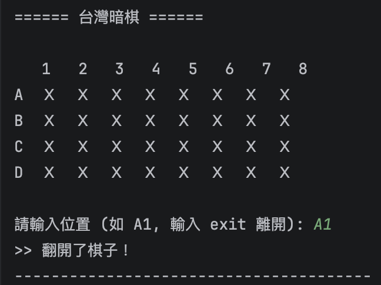
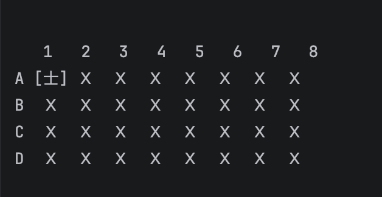

暗吃
（自己人）

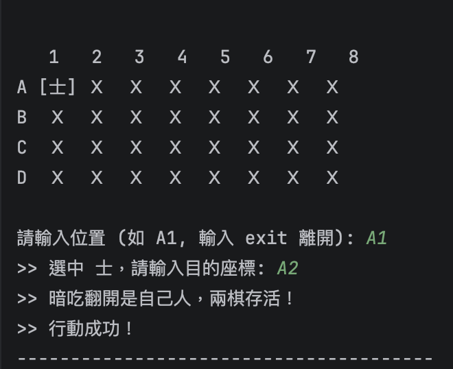
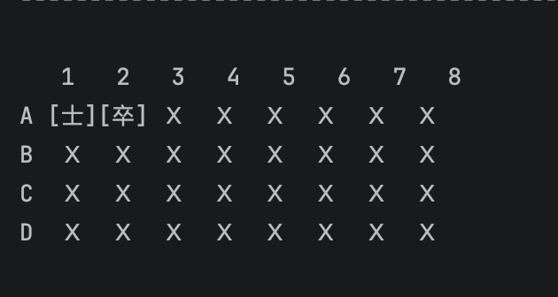

暗吃
（敵人）

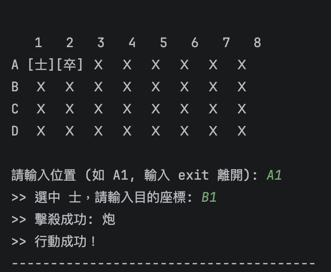
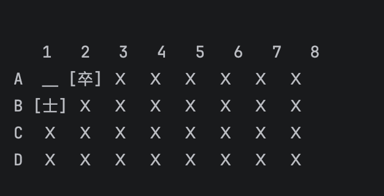

暗吃
（自爆）

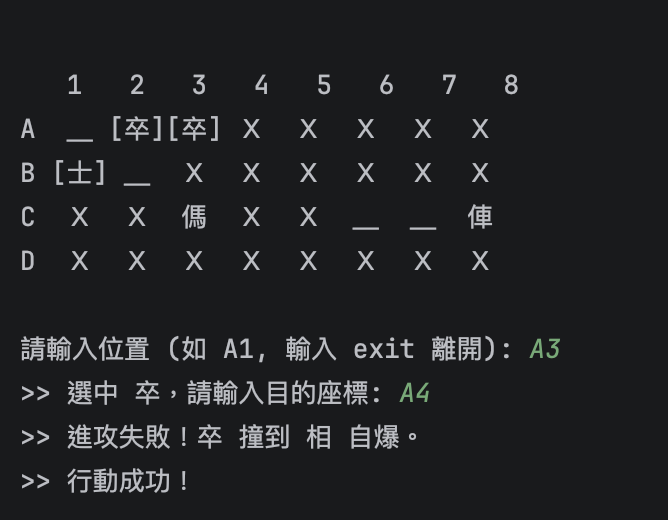
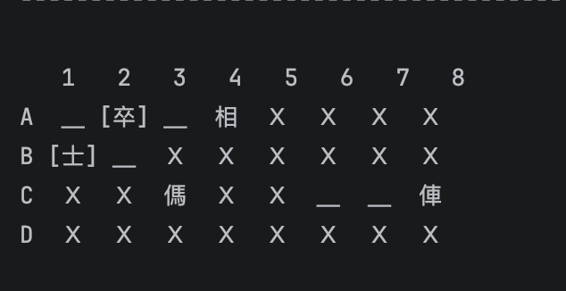

明吃
（小吃大）

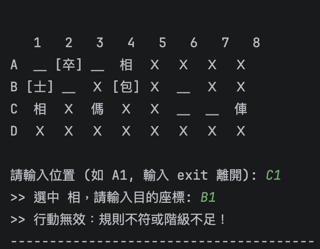
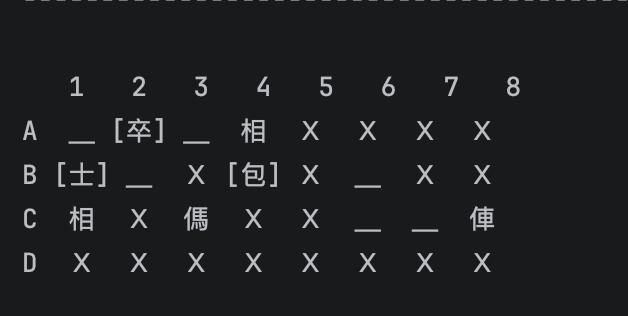

明吃
（大吃小）

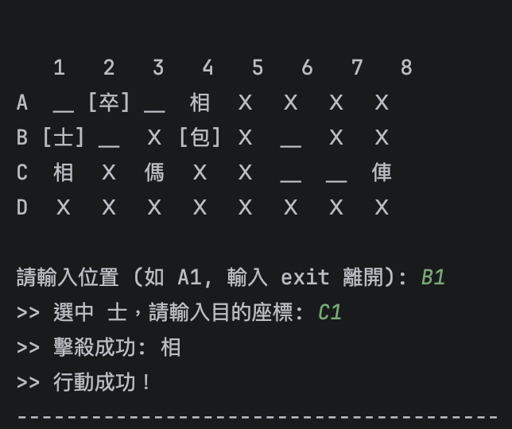
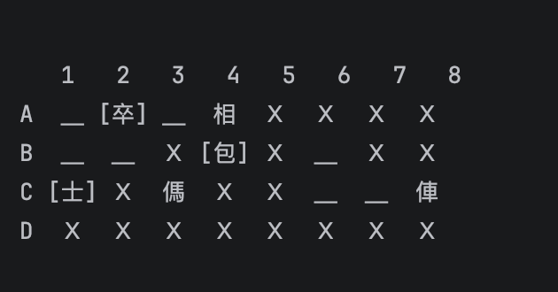

馬斜吃

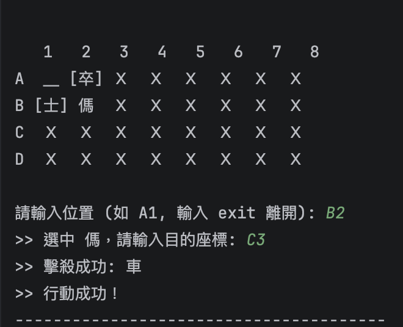
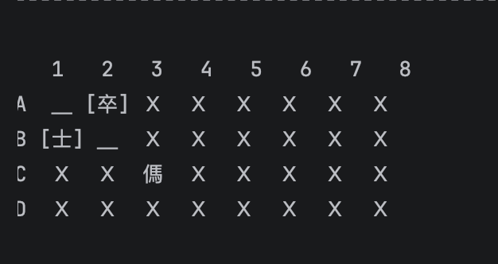

車衝刺

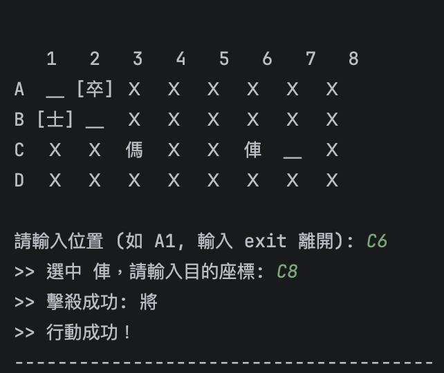
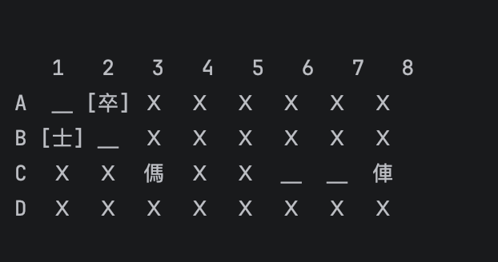

砲飛山

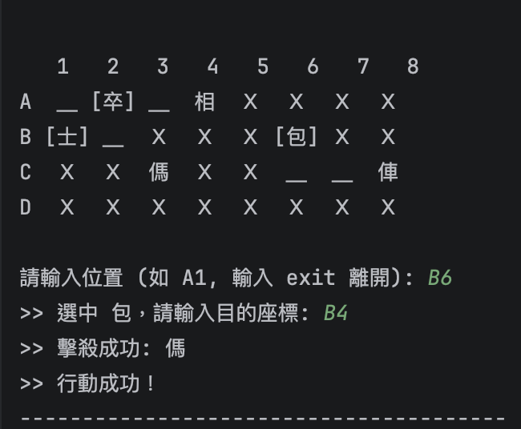
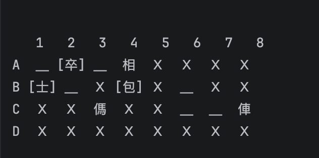

# AI 使用狀況與心得
AI使用層級：層級二
開發過程中，與 AI 互動次數約為 8-10 次，重點內容如下：
功能提升 (Enhancement)：在已完成的基礎移動架構上，引導 AI 協助撰寫進階規則，包含：
炮 (包)：實作「隔子跳吃」的 countBetween 判定邏輯。
馬 (傌)：實作「移攻分離」邏輯，達成移動走橫直、斜向吃子的功能。
車 (俥)：實作「衝刺吃子」邏輯，達成位移超過一格即可無視階級吃子的能力。
除錯 (Debugging)：修正 IntelliJ 提示之 Incompatible types（處理 void 與 boolean 之衝突）以及解決路徑掃描時的陣列越界錯誤。
觀念釐清：透過 AI 解釋 final 關鍵字在陣列物件中的作用，優化程式碼穩定性。

手動（沒有使用 AI）的部分:
基礎功能建構：獨立完成遊戲的基本骨架，包含：
介面開發：撰寫 showAllChess 顯示 4x8 棋盤與座標系統。
核心屬性判斷：實作棋子的階級大小判定（canEat）以及基礎的上下左右移動（一次一格）。
初始化邏輯：撰寫棋子洗牌與 posToIndex 座標轉換邏輯。
視覺化介面：toString() 的顯示格式，確保紅黑陣營在 Console 下有清晰的視覺區隔。
規則邏輯決策：定義何時該「自爆」與何時該「攔截無效移動」，確保符合暗棋規則。

## 心得
實用性跟效率：
我自己先動手寫好了棋盤介面、最基本的移動這些骨架，這部分不難但有點瑣碎。後來要加入「車衝刺、馬斜吃、炮飛山」時，就想說用AI來幫忙，果然省去很多的時間，看來還是少不了AI 。
對學習的影響：
我覺得用AI不代表就是偷懶，反而更像是在測試自己的邏輯。我先寫好了骨架，再找 AI 討論怎麼把「車馬炮」的路徑判斷加進去。這種合作方式讓我更清楚如何把腦子裡的遊戲規則，轉變成程式碼，對整個 OOP 架構的設計也更有實感。